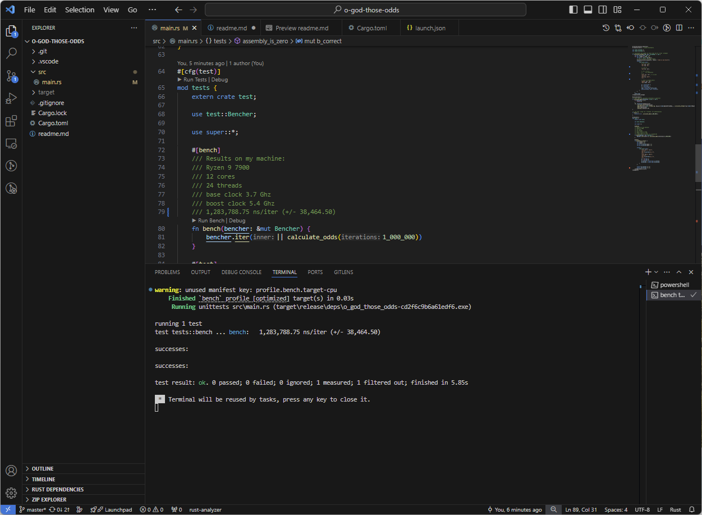

# o-ogod-those-odds

uses the [rayon][1] crate for parallelization and [rand][2] to preform 1,000,000 double coin flips in 1,283,788.75 ns.

## Multithreading 
The [`ParallelIterator::map_init`][3] method allows us to reuse [`ThreadRng`][4] between iterations.
Each thread calls the `init` function to get an instance of [`ThreadRng`][4] to use when calling the `map_op` function

## Binary ops
The [`ThreadRng`][4] random number generator produces integers where each bit has an equal chance of being 1 or 0, this can 
be leveraged to maxamize the amount of moves preformed per call. Each integer is divided into two 32 bit parts which are anded 
together the result is a 32 bit integer where each bit has a 1/4 chance of being 1, by using the popcnt assembly operation 
32 moves can be calculated all at once. This means all required moves can be calculated with 8 calls to [`Rng::gen`][5] (7 * 32 = 224, plus one for the remaining 7).


```
And truth table
    ┌───┬───┐
    │ 0 │ 1 │
┌───┼───┼───┤
│ 0 │ 0 │ 0 │
├───┼───┼───┤
│ 1 │ 0 │ 1 │
└───┴───┴───┘
```

## Assembly 
For some reason preforming the shifting in an assembly block makes this algorithm faster. This could be due to a reduced number of branches.

## Proof




[1]: https://docs.rs/rand/latest/rayon/
[2]: https://docs.rs/rand/latest/rand/
[3]: https://docs.rs/rayon/latest/rayon/iter/trait.ParallelIterator.html#method.map_init
[4]: https://docs.rs/rand/latest/rand/rngs/struct.ThreadRng.html
[5]: https://docs.rs/rand/latest/rand/trait.Rng.html#method.gen